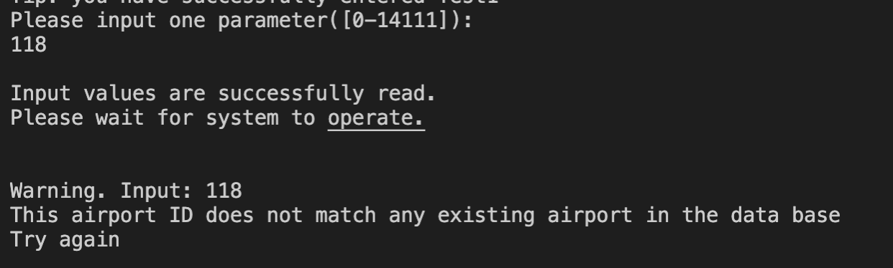

# CS 225 Final Project Report

## Team Members:  

Jibing Yao (jibingy2), Bo Jia (bojia2), Chenxu Liu (chenxul2), Shuchen Wu (sw18)

This is a written version of our final project report. The report will introduce the functionality of our project and also show the results generated by it. Our final project successfully implements all of the three algorithms described in the proposal, including BFS, Dijkastra, and Betweenness Centrality.

### Algorithm Introduction

##### Breadth First Traversal

Firstly, we implement a basic graph algorithm, the Breadth First Traversal. This algorithm aims at visiting every airport node in the graph. It is necessary for us to clarify one thing here. The traditional graph BFS should traverse every node and every edge in the graph. In our project, although we adopt a graph structure design that does not have an "edge" class explicitly, the task of traversing every edge has also been done during the process of the traversal. When checking adjacent airports of the current airport, if the adjacent node has been visited before, we mark the "edge" between the two airports as a cross edge, otherwise we mark it as a discovery edge. This algorithm implementation is proved to be successful in terms of completeness and uniqueness. That is, every valid airport node has been visited and for only once. During the process of the traversal, we maintain a "visited" vector to avoid visiting the same airport more than once. Also, we have provided a test case to prove that every airport has been visited after the traversal. The path can also be proved by checking source airport’s destination airport list and destination airport’s incoming airport list. In addition, since our graph structure desgin could get neighbor airport nodes in O(deg(v)), the time complexity of this BFS is O(m+n), where n is the number of nodes and m is the number of edges.

##### Dijkstra

Secondly, we have implemented the Dijkstra algorithm to calculate the shorest path from a source airport to a destination airport. In our graph, we choose the distance between two airports as the edge weights. To verify the output of the shortest path function. We calculate and compare the distance difference between shortest paths with one or more stop nodes and their corresponding direct distance. We find the difference between two distances are always short, no more than 1000 km, for the cases we have tested. Also, in our research, we find that the tested shortest paths always have little curvature in the world map. In addition, we find that the stop nodes’ betweenness centrality is always very large and their destination airport list’s size is large as well, more than 200 airports. Thus, we consider our implementation of Dijkastra algorithm as successful. As for time efficiency, since we implement this algorithm using priority queue, the time complexity would be O(mlog(n)+n).

##### Betweenness Centrality

Last, for Betweenness Centrality, the function  that implements the algorithm is based on the rationale from shortest paths. We count every airport’s occurrence number as shortest paths’ transit nodes. The one with largest occurrence number must be the node with largest betweenness centrality. Therefore, based on the correctness of our Dijkastra algorithm, our Betweenness Centrality algorithm is also correct. One thing to notice is that due to some flaws of the dataset (there are some weird airlines such that the plane could go but can never come back), here we do not calculate the "global" betweenness centrality, which is the total number of shortest paths between any two airports in the graph that pass through this specific node, we only find the node with the largest betweenness centrality with respect to a source starting airport node. The airport node we find using this algorithm would be the most "important" or "influential" transporation hub for the starting airport. For time complexity, we have found that the shorest paths are generally short, so here we assume each calling of dijkstra is O(1) constant time. Then, we calculate all the shorest paths between the starting airport and all the other (n - 1) airports, keeping track of stop nodes at the same time, and finally we pick the node with the largest betwenness centrality. Therefore, the overall time complexity is O(n).

### Interface & Results

Firstly, users could see each valid airport's information and its destination and incoming source airports. To achieve this, users should follow the instructions specified in *README.md* and enter the corresponding section 1 and 2.

Example output of airports' information:

 

 

 

##### Breadth First Traversal

We have written functions *BFS_id(int)*, *BFS_name(string)*, *BFS_IATA(string)* with different properties of the starting airport as inputs. Users could call these these functions in *main.cpp* and the results would be stored in ***jibingy2-bojia2-chenxul2-sw18/output/bfs_output***. In addition, users can also do the BFS on all the connected components of the whole graph by calling *BFS_all()* and this full result can be found in ***jibingy2-bojia2-chenxul2-sw18/output/bfs_all_output***.

Example output of BFS:

*Koné Airport->Nouméa Magenta Airport->Île des Pins Airport->Koumac Airport->Lifou Airport->Maré Airport->Tiga Airport->Touho Airport->
Ouvéa Airport->Île Art - Waala Airport*

##### Dijkstra

To obtain the shortest path between the source and the destination airport node, users should follow the instructions specified in *README.md* and enter the corresponding section 3. 

Example output of shortest path:

##### Betweenness Centrality

To get the airport with the largest betweenness centrality with respect to a source node, users should follow the instructions specified in *README.md* and enter the corresponding section 4. 

Example output of betwenness centrality:

*Note: All of the above pictures are generated by our final project, and the code that are used to generate these outputs can be found in  main.cpp, graph.cpp, and helper.cpp.* All test cases are written in * tests/test.cpp.*

